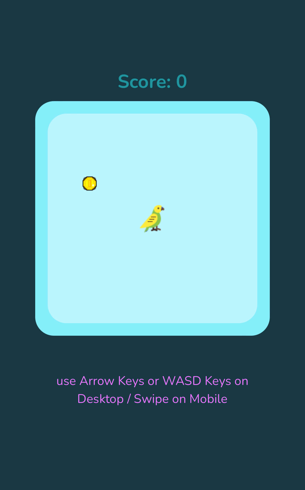

# Canvas Game

This is a simple game that I made with canvas, css and javascript. Grab as many coin as you can and avoid the walls.

## Live Demo

- [Play Now](https://emanuelefavero.github.io/canvas-game/)

#### Screenshot

## How to play

- Desktop: Use the arrow keys or WASD keys to move the player
- Mobile: Swipe to move the player

## How to run the game locally

- Clone the repository
- Open the `index.html` file in your browser

## License

- [MIT](LICENSE.md)
